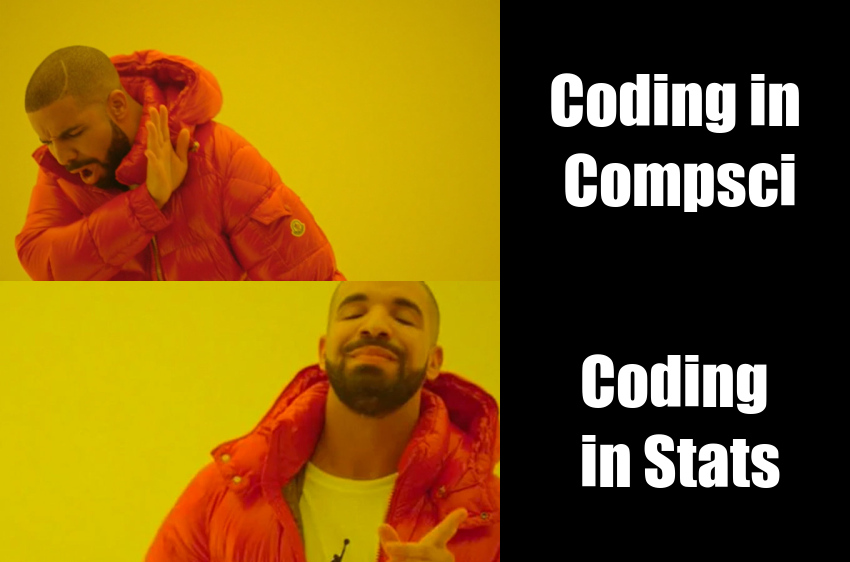

# Kia ora!
## Below is an original work created using R code. This code combines 4 different image blocks to replicate and adapt the popular "Drake Hotline Bling" meme format
### *The motivation for this meme was the surprising applications of code in statistics and how its application is more enjoyable than a traditional computer science approach to coding.*





### Code for meme:

```r
library(magick)

drake_no <- image_read("https://i1.wp.com/www.sopitas.com/wp-content/uploads/2017/08/drake-no-meme.jpg") %>%
  image_scale(500)

drake_yes <- image_read("https://i.kym-cdn.com/entries/icons/mobile/000/020/147/drake.jpg") %>%
  image_scale(500) 

computer_science_text <- image_blank(width = 350, 
                          height = 281, 
                          color = "#000000") %>%
  image_annotate(text = "Coding\n in Stats",
                 color = "#FFFFFF",
                 size = 65,
                 font = "Impact",
                 gravity = "center")

statistics_text <- image_blank(width = 350, 
                         height = 281, 
                         color = "#000000") %>%
  image_annotate(text = "Coding in\n Compsci",
                 color = "#FFFFFF",
                 size = 65,
                 font = "Impact",
                 gravity = "center") 
  

top_row <- c(drake_no, statistics_text) %>%
  image_append()

bottom_row <- c(drake_yes, computer_science_text) %>%
  image_append()

meme <- c(top_row, bottom_row) %>%
  image_append(stack = TRUE)

image_write(meme, "my_meme.png")
```


